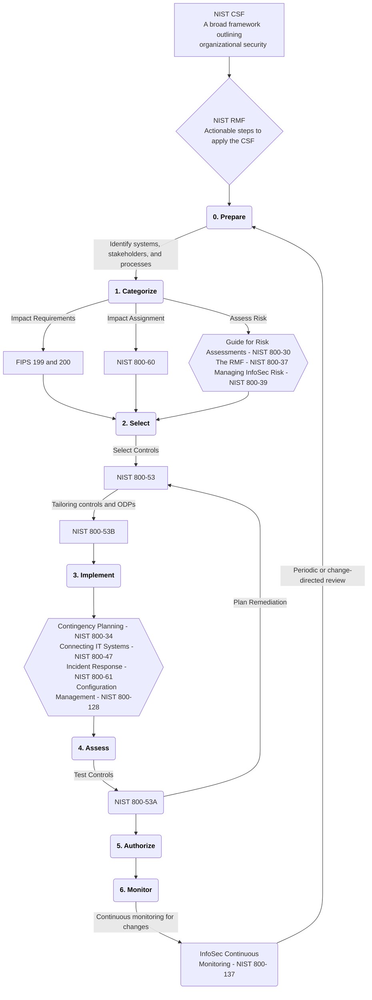

---
{"dg-publish":true,"permalink":"/frameworks-standards-and-regulations/nist/mermaid-nist-csf/"}
---

```mermaid
flowchart TD
    A["NIST CSF
    A broad framework outlining
    organizational security"] --> B{"NIST RMF
    Actionable steps to
    apply the CSF"}
  
    B --> Z("`**0. Prepare**`")
  
    Z --> |Identify systems, stakeholders, and processes| C("`**1. Categorize**`")
    C --> |Impact Requirements| D[FIPS 199 and 200]
    C --> |Impact Assignment| E[NIST 800-60]
    C --> |Assess Risk| P{{"Guide for Risk Assessments - NIST 800-30
    The RMF - NIST 800-37
    Managing InfoSec Risk - NIST 800-39"}}
  
    D & E & P --> F("`**2. Select**`")
    F --> |Select Controls| G[NIST 800-53]
    G --> |Tailoring controls and ODPs| S[NIST 800-53B]
  
    S --> H("`**3. Implement**`")
    H --> I{{"Contingency Planning - NIST 800-34
    Connecting IT Systems - NIST 800-47
    Incident Response - NIST 800-61
    Configuration Management - NIST 800-128"}}
  
    I --> M("`**4. Assess**`")
    M --> |Test Controls| R("NIST 800-53A")
    R --> |Plan Remediation| G
 
    R --> N("`**5. Authorize**`")
    N --> O("`**6. Monitor**`")
    O --> |Continuous monitoring for changes| Q("InfoSec Continuous
    Monitoring - NIST 800-137")
    Q --> |Periodic or change-directed review| Z

style Z color:#000000
style C color:#000000
style F color:#000000
style H color:#000000
style M color:#000000
style N color:#000000
style O color:#000000
```

