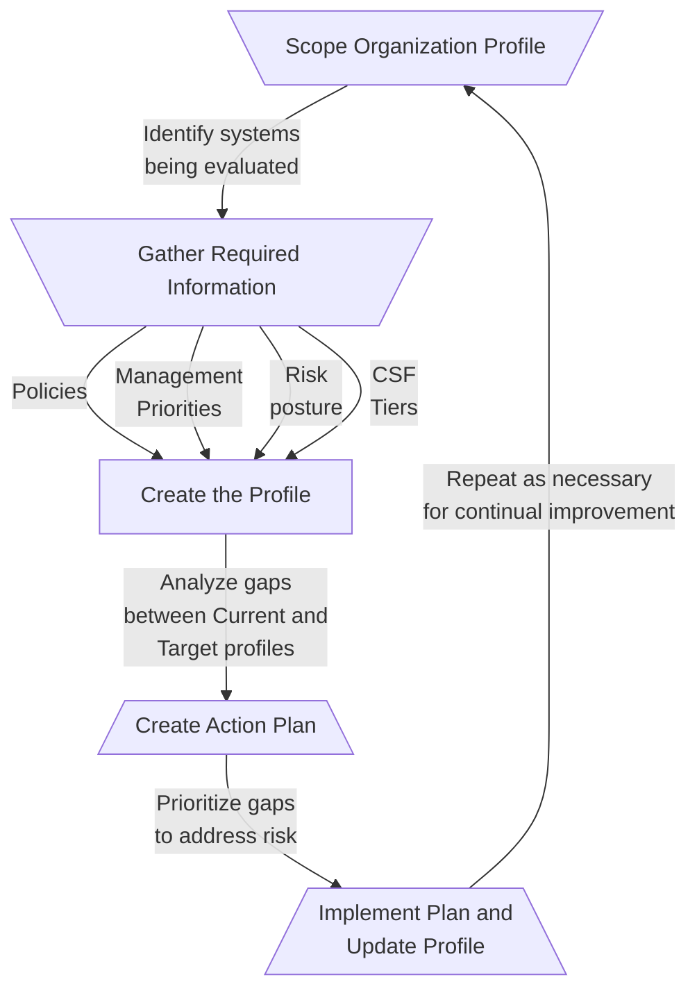

---
{"dg-publish":true,"permalink":"/frameworks-standards-and-regulations/nist/nist-csf/nist-csf/"}
---

> If you are just getting started, I recommend [just reading it](https://nvlpubs.nist.gov/nistpubs/CSWP/NIST.CSWP.29.pdf) since it's only **32 pages** long.
>  From the *Introduction* to *Appendix A* is **15 pages**; it's not that much.

## What is it?
1. The CSF provides a *high-level overview of cybersecurity* concepts and outlines **six Core functions** to achieve risk management outcomes: Govern, Identify, Protect, Detect, Respond, and Recover.
2. The CSF is not prescriptive, and is intended to be used with other frameworks and resources
	1. Its goal is to help organizations *identify and assess*, *prioritize*, and *communicate* cyber risks
		1. Identify and assess
			1. Describe the security posture of the organization
			2. Determine gaps and progress towards addressing gaps
		2. Prioritize
			1. Prioritize and action against cybersecurity risks in alignment with an organization's mission and governance expectations, and regulatory and legal requirements
		3. Communicate
			1. Provide a common language for high-level cybersecurity risk management
	2. The [Informative References](https://www.nist.gov/cyberframework/informative-references) documents maps the Core functions to different categories and subcategories (outcomes)
		1. For example, Identity Asset Management 01 (ID.AM-02) lists multiple other frameworks and resources which could be used to fulfill its outcome (CSF v1.1, ISO 27001, [[Frameworks, Standards, and Regulations/NIST/NIST 800-53/800-53R5\|800-53R5]], etc.).  

## CSF Overview
1. CSF is composed of three components:
	1. *CSF Core*
		1. Uses 6 functions to identify cybersecurity risk outcomes
		2. Intended to be understandable by *executives*, *managers*, and *practitioners* alike
	2. *CSF Organizational Profiles*
		1. Mechanisms for building an organization's profile that maps to the Core
		2. Can be used to understand *current* security posture or a desired *target* posture.
	3. *CSF Tiers*
		1. A method of characterizing the cybersecurity "rigor" of an organizational profile
		2. Range from Tier 1^[Partial implementation or limited awareness of risk.] (lowest) to Tier 4^[Highly integrated into the organization or highly adaptive to cybersecurity risks.] (highest)
2. Additional resources on the [NIST CSF website](https://www.nist.gov/cyberframework):
	1. Informative References
		1. Real-world outcomes; basically, which outcomes are mapped to which controls.
			1. Follow the "Download English (xlsx)" link for the most recent list of mappings: [CSF 2.0 Informative References - NIST](https://www.nist.gov/cyberframework/informative-references)
	2. Implementation Examples
		1. Examples on how certain outcomes can be achieved
	3. Quick-Start Guides
		1. "A supplementary resource that gives brief, actionable guidance on specific CSF-related topics."
	4. Community Profiles and Organizational Profile Templates
		1. Profiles that have been pre-tailored for organizations in different areas
			1. for example, the Cloud Security Alliance community profile^[[NIST CSF v2 Cloud Community Profile - Based on CCM v4 \| CSA](https://cloudsecurityalliance.org/artifacts/nist-csf-v2-cloud-community-profile-based-on-ccm-v4)] which integrates the "Cloud Controls Matrix v.4" with the CSF.

## The Core Functions
1. There are six core Functions in the CSF:
	1. Govern
		1. The newest and most *core* of core functions
			1. It's critical to integrating the other Functions into an organization, and is at the center of the framework, touching all other functions
		2. Built with new and reorganized categories from the other functions
			1. When using the [CSF 2.0 Reference Tool](https://csrc.nist.gov/Projects/Cybersecurity-Framework/Filters#/csf/filters), you will see "Withdrawn" categories and subcategories that now match to Governance
		3. Governance "informs how an organization will implement the other five Functions."
	2. Identify
		1. Identify and understand the cybersecurity risks for your organization
			1. Assets, software, risks, system ownership and responsibilities, etc.
			2. For example, all of the XX-01 controls in the 800-53
	3. Protect
		1. Safeguards to manage risk.
			1. Preventive measures; passwords and authentication, physical access controls, etc.
	4. Detect
		1. How the organization detects and analyzes attacks and breaches.
			1. e.g., logging, alerts, honeypots, etc.
	5. Respond
		1. Incident response and mitigation
	6. Recover
		1. Restoring operation to impacted systems, determining how the incident occurred, and taking steps to prevent it from happening again
2. Each *core function* is composed of *categories* and *subcategories*
	1. Categories and subcategories use shorthand identifiers
		1. Function.*Category*-**Subcategory**
			1. e.g., "GV.*OV*-**01**" would be Governance *Oversight*, subcategory **01**
	2. These categories and subcategories are broad statements of specific organizational outcomes
		1. For example, "Detect-Adverse Analysis-06":
			1. "**DE.AE-06** : Information on adverse events is provided to authorized staff and tools"
	3. Each subcategory includes implementation examples to help system owners identify and configure controls

## CSF Organizational Profiles

1. From the text, "A CSF Organizational Profile describes an organization’s current and/or target cybersecurity posture in terms of the Core’s outcomes."^[[nvlpubs.nist.gov/nistpubs/CSWP/NIST.CSWP.29.pdf](https://nvlpubs.nist.gov/nistpubs/CSWP/NIST.CSWP.29.pdf)]
2. Each organization creates two profiles
	1. A "Current" profile that describes which outcomes the organization is trying to achieve and why
	2. A "Target" profile that describes desired outcomes, in anticipation of new requirements, technology, threat intelligence, etc.
3. The difference between the profiles is used to construct a [[Frameworks, Standards, and Regulations/NIST/NIST CSF/Plan of Action and Milestones\|roadmap]] for the organization

The CSF provides a 5 step process for implementing profiles:
1. Scope the Organizational Profile
2. Gather the information needed to prepare the Organizational Profile
3. Create the Organizational Profile
4. Analyze the gaps between the Current and Target profiles, and create an action plan
5. Implement the action plan and update the Organizational Profile

## CSF Tiers
"Tiers characterize the rigor of an organization’s cybersecurity risk governance and management practices, and they provide context for how an organization views cybersecurity risks and the processes in place to manage those risks."^[[nvlpubs.nist.gov/nistpubs/CSWP/NIST.CSWP.29.pdf](https://nvlpubs.nist.gov/nistpubs/CSWP/NIST.CSWP.29.pdf)]
1. There are four tiers, escalating from partial, ad hoc implementation to agile and risk-informed:
	1. Tier 1: Partial
	2. Tier 2: Risk Informed
	3. Tier 3: Repeatable
	4. Tier 4: Adaptive
2. Each tier requires more resources than the last
	1. It is important to consider cost and risk when determining which Tier is appropriate
	2. Not all organizations need Tier 4 goals, much like in the [[Frameworks, Standards, and Regulations/NIST/RMF/NIST SP 800-37 (RMF)\|RMF]] how not all organizations are considered "High Risk"

## [CSF 2.0 Reference Tool](https://csrc.nist.gov/Projects/Cybersecurity-Framework/Filters#/csf/filters)
1. Contains a full list of functions, categories, and subcategories
	1. Also lists one or more *Implementation examples* per subcategory
	2. Items that were changed between CSF 1.1 and 2.0 are highlighted and detailed
2. Allows you to easily search, filter, and export functions and categories
	1. Can export as JSON or .xlsx file
		1. Excel Spreadsheet output is configured as a sortable table

# Resources
#### Official
- [Cybersecurity Framework | NIST](https://www.nist.gov/cyberframework)
	- Homepage, full document here: [nvlpubs.nist.gov/nistpubs/CSWP/NIST.CSWP.29.pdf](https://nvlpubs.nist.gov/nistpubs/CSWP/NIST.CSWP.29.pdf)
	- 32 pages long
- [CSF 2.0 Quick Start Guides \| NIST](https://www.nist.gov/cyberframework/quick-start-guides)
	- These quick start guides are a great place to get started

#### Supplemental
- [Hands on with the NIST Cybersecurity Framework 2.0 w/ Nathan Sweaney - YouTube](https://www.youtube.com/watch?v=BrWw62XCQg0)
	- 1 hour long, starts going over the CSF around 22:30
	- Excellent short video discussing the new CSF 2.0 framework
- [A Tale of Two Frameworks: The NIST CSF and NIST RMF Are Not the Same - Telos Corporation](https://www.telos.com/blog/2017/05/18/tale-of-two-frameworks-nist-csf-and-nist-rmf-confusion/)
	- Short article
- [CertMike Explains NIST Cybersecurity Framework - YouTube](https://www.youtube.com/watch?v=_KXqDNVmpu8)
	- 5 minutes
- [NIST Cybersecurity Framework - YouTube](https://www.youtube.com/playlist?list=PLxC28bkWNxkM1AVwmhF0Xfbs8F-NMox0I)
	- Playlist, around 2-hours of content
- [Use the NIST Cybersecurity Framework for your Business! - YouTube](https://www.youtube.com/watch?v=W3vXJpcbA98)
	- 10 minutes