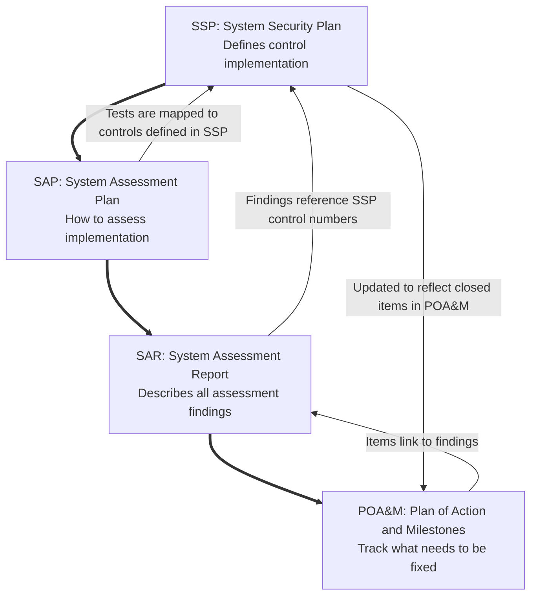

---
{"dg-publish":true,"permalink":"/frameworks-standards-and-regulations/nist/nist-frameworks-and-s-ps-overview/"}
---

When I was first getting oriented and searching the internet for help, I found a common theme that was interesting; technical people tended to over emphasize the importance of the 800-53 and undersell the importance of the CSF and RMF. One could argue this is because the CSF and RMF are significantly smaller documents and go into less detail, but I think it comes down to who we are as technicians. We get absorbed in the how, and ignore or forget about the why.

I can't help but feel like NIST also found this, and is why they made the "*Govern*" function central to all other funcitons.

I hope this helps fellow technical people to see the forest through the trees.
### What's the recommended order for study leading to the 800-53?
Based on my research and understanding, here's my understanding on how the [[Frameworks, Standards, and Regulations/NIST/NIST CSF/NIST CSF\|NIST CSF]], [[Frameworks, Standards, and Regulations/NIST/NIST SP 800-37\|RMF]], and [[Frameworks, Standards, and Regulations/NIST/NIST 800-53/800-53R5\|800-53R5]] fit together.

- The *CSF* is a set of guidelines and best practices designed to help organizations manage and reduce cybersecurity risks, focusing on five core functions: Identify, Protect, Detect, Respond, and Recover.
- The *RMF* complements the *CSF* by providing a systematic process for managing security and privacy risks, outlined in a series of steps.
- The *800-53* is a catalog of security and privacy controls that organizations can use to protect information systems and manage risks identified within the *RMF*. 

Each of these documents (in particular the *RMF* and *800-53*) are supported by *Special Publications* (*SP*s) that delve^[Or "dive" if "delve" is too arcane a word for you.] into more specific topics and provide additional examples, context, and guidance to help you secure your organization.

 I've created a flow-chart to better illustrate this and identify how some of the SPs are used.

NIST also has their own chart (below), which reflects the circular nature of a strong security posture and the broad relevance of some Special Publications.

^[[Risk Management Framework (RMF) Overview - FISMA Implementation Project | CSRC](https://csrc.nist.rip/Projects/Risk-Management/Risk-Management-Framework-(RMF)-Overview)]

#### Additional Resources
Below are other sources I've used to orient myself to the NIST ecosystem of publications, with some notes on use and usefulness.

##### NIST Courses
NIST has a series of *free online courses* to introduce anyone to the [[Frameworks, Standards, and Regulations/NIST/NIST SP 800-37\|RMF (800-37)]], [[Frameworks, Standards, and Regulations/NIST/NIST 800-53/800-53R5\|800-53]], the [[Frameworks, Standards, and Regulations/NIST/NIST 800-53/800-53A\|800-53A]], and [[Frameworks, Standards, and Regulations/NIST/NIST 800-53/800-53B\|800-53B]], accessible here: [NIST RMF Online Introductory Courses | CSRC](https://csrc.nist.gov/projects/risk-management/rmf-courses)

The complete courses are *6 hours in length* (3 for the *RMF* and 3 total for the *800-53*, *53A*, and *53B*). The courses use cookies to track progress through the slides. You're not allowed to skip forward and can't adjust the speed, which is not ideal,^[It actually kind of sucks, because it means you can't continue progress easily on another device.] but I guess it's better than creating an account.^[One COULD theoretically use tools like Move Mouse and Greenshot (which gives precise mouse coordinates) to automate mouse movements and clicks to skip to the last two seconds of the video progress bar and then click "Next" to progress the slides, running it while taking a break, and then coming back later to peruse the slides and lectures at your leisure.^[Also, it turns out that this is basically built into the tool; you can just click the active slide twice to skip to the next one. I don't know why any of this was done, and am confused.]]

##### RiskOptics
This guide ([Complete Guide to the NIST Cybersecurity Framework — RiskOptics](https://reciprocity.com/resource-center/complete-guide-to-the-nist-cybersecurity-framework/)) provides a thorough introduction to the NIST Cybersecurity Framework and how it interrelates.

<a class="markdown-embed-link" href="/frameworks-standards-and-regulations/nist/nist-sp-800-37/#gerald-auger-definitive-guide-to-rmf-2021" aria-label="Open link"><svg xmlns="http://www.w3.org/2000/svg" width="24" height="24" viewBox="0 0 24 24" fill="none" stroke="currentColor" stroke-width="2" stroke-linecap="round" stroke-linejoin="round" class="svg-icon lucide-link"><path d="M10 13a5 5 0 0 0 7.54.54l3-3a5 5 0 0 0-7.07-7.07l-1.72 1.71"></path><path d="M14 11a5 5 0 0 0-7.54-.54l-3 3a5 5 0 0 0 7.07 7.07l1.71-1.71"></path></svg></a>

#### NIST SP 800-37 (RMF)
- "The Risk Management Framework (RMF) provides a process that integrates security, privacy, and cyber supply chain risk management activities into the system development life cycle."^[[NIST Risk Management Framework | CSRC](https://csrc.nist.gov/projects/risk-management/about-rmf)]
- RMF map created by Aron Lange:^[ [Here are some of the top free resources that will help you to break into GRC and information security. - Aron Lange](https://www.linkedin.com/feed/update/urn:li:activity:6977867944248627200)] ^[This is for my own reference, and won't be accessible on the site: [[NIST RMF.pdf]]]

<iframe src="https://drive.google.com/file/d/10CcrJEA3GEe8Hjk35PlGQc0c8bTWVnCM/preview" width="640" height="480" allow="autoplay"></iframe>

  <a href="https://drive.google.com/file/d/10CcrJEA3GEe8Hjk35PlGQc0c8bTWVnCM/view?usp=sharingdl=1" target="_blank">
    Download the NIST RMF PDF by Aron Lange
  </a>

## Critical Documents in the RMF Process
SSP → SAP → SAR → POA&M
- **Select Controls**
	- SSP defines what should be implemented
- **Assess Controls**
	- SAP defines how to test implementations
	- SAR documents what was found
	- POA&M tracks what needs to be fixed

## RMF
1. The [[Frameworks, Standards, and Regulations/NIST/NIST SP 800-37\|RMF]] is a *7-step* continuous cycle to understand and provide a uniform approach to securing information systems
	1. These are the steps:
		1. Prepare
		2. Categorize
		3. Select
		4. Implement
		5. Assess (Audit)
		6. Authorize
		7. Monitor
2. RMF Step Guide
	1. **Prepare**:^[Not discussed in Gerald's video, but detailed here for reference.] Setup the organization for success
		1. Identify systems and stakeholders in the business and assign role for executing the RMF
		2. Conduct risk assessments and get a baseline of current risk and security practices
		3. **Max note**: Without any practical experience myself, I feel like Gerald combined the *Prepare* and *Categorize* tasks, and I think that omission would likely make subsequent steps more difficult.
	2. **Categorize**: Identifying potential impact
		1. [[FIPS 199\|FIPS 199]] and [[Frameworks, Standards, and Regulations/NIST/NIST 800-53/FIPS 200\|FIPS 200]] are used to identify potential impact of a system
			1. Describes the importance of a system and steps required to secure it
		2. Impact ratings are chosen between High, Moderate, and Low
			1. 80-90% of systems are *Moderate* impact systems
			2. *High* ratings are reserved for national security or classified systems
			3. *Low* ratings are also rare, non-business critical
		3. [[Frameworks, Standards, and Regulations/NIST/NIST SP 800-60\|NIST SP 800-60]] provides guidelines on the impact you should assign to certain systems
			1. More on this here: [NIST RMF System Categorization Step Hands On (Using SP 800-60 Vol II) - YouTube](https://www.youtube.com/watch?v=yAfM2E2aJEM)
		4. The [[Frameworks, Standards, and Regulations/NIST/NIST CSF/NIST CSF\|NIST CSF]] provides a mapping 
	3. **Select**: Select controls to implement from [[Frameworks, Standards, and Regulations/NIST/NIST 800-53/800-53R5\|NIST 800-53]]
		1. Basically a big dictionary with hundreds of controls
		2. The outcome of this step is the *SSP* ([[Frameworks, Standards, and Regulations/NIST/System Security Plan\|System Security Plan]]), and instructions on how to create one are found in the [NIST SP 800-18](https://csrc.nist.gov/pubs/sp/800/18/r1/final)
			1. This is the book/plan for the documentation of your system
				1. Network diagram, who owns the system, what kind of data is stored, etc.
				2. All the controls to secure the systems and how they are implemented
					1. May be more or less complicated, depending on the size of the organization
			2. Gerald specifically mentions the [[NIST SP 800-15\|NIST SP 800-15]], but it was withdrawn in September of the year he published his video
	4. **Implement**: Implement the controls, the lions-share of the work
		1. If you have any challenges implementing controls, NIST has implementation guides for most systems
			1. Offer tons of instructions and things you can do
	5. **Assess**: Bring in an independent auditor to inspect your controls
		1. For [[Frameworks, Standards, and Regulations/NIST/FISMA\|FISMA]] or anything else, you will need an external auditor
			1. If this is purely internal, can do it yourself, but it's better to have someone else verify
	6. **Authorize**: Authorize the system
		1. Basically just a memo from the person responsible authorizing the system to operate
			1. Usually just a page or so with their signature
		2. What's missing in this (as of 2021) is a risk assessment
			1. Use [[NIST 800-30\|NIST 800-30]] to asses risk
				1. Residual risk for controls not implemented, etc.
		3. This grants an Authorization to Operate for 1-3 years, depending on the requirements
	7. **Monitor**: Monitor the controls
		1. Systems are monitored and brought re-audited at regular intervals
		2. Often the audits are often scheduled to be tested in a kind of sequence to prevent infrequent massive effort

# Resources

#### Official
- [NIST Risk Management Framework \| CSRC](https://csrc.nist.gov/projects/risk-management/about-rmf)
	- [SP 800-37 Rev. 2, Risk Management Framework for Information Systems and Organizations: A System Life Cycle Approach for Security and Privacy | CSRC](https://csrc.nist.gov/pubs/sp/800/37/r2/final)
	- Direct link to the PDF: [nvlpubs.nist.gov/nistpubs/SpecialPublications/NIST.SP.800-37r2.pdf](https://nvlpubs.nist.gov/nistpubs/SpecialPublications/NIST.SP.800-37r2.pdf)
	- 183 pages
- [dhs.gov/sites/default/files/2023-08/23\_0803\_cpo\_ security-authorization-process-guide.pdf](https://www.dhs.gov/sites/default/files/2023-08/23_0803_cpo_%20security-authorization-process-guide.pdf)
	- This is the DHS "System Security Authorization Process Guide"
	- 32 pages (66 with appendices) that maps the RMF to their ATO (authorization to operate) process.
#### Supplemental
##### Articles
- ~~[NIST Risk Management Framework - by Aron Lange](https://blog.grclab.com/p/nist-risk-management-framework)~~
	- 	Super short and has a great graphic which details every step and task of the RMF
	- Original link down; updated link to LinkedIn post here, which has additional resources and the graphic but lacks the article: [💥Here are some of the top free resources that will help you to break into GRC and information security. - Aron Lange](https://www.linkedin.com/feed/update/urn:li:activity:6977867944248627200)
##### Videos
- Dr. Gerald Auger^[oh-zher]
	- [Definitive Guide to RMF (Actionable plan for FISMA Compliance) - YouTube](https://www.youtube.com/watch?v=8zxzqpw0jBA)
		- 15 minute long video
		- Older, includes references to documents that have been withdrawn and doesn't include the "Prepare" phase
	- [NIST RMF FULLY EXPLAINED (IN PLAIN ENGLISH) - YouTube](https://www.youtube.com/watch?v=Z2okRecJC7E)
		- 1h12m video *long*
		- I love and hate Gerry Auger videos; his content is great and helpful, but his style meanders and can be very distracting

##### ChatGPT
The list below was generated by ChatGPT, and it feels like it front loads a lot, according to the Gerald Auger video. 
1. [[Frameworks, Standards, and Regulations/NIST/NIST CSF/NIST CSF\|NIST CSF]]
	1. **Purpose**: The CSF provides a high-level overview of cybersecurity concepts and outlines six core functions: Govern, Identify, Protect, Detect, Respond, and Recover. Understanding the CSF helps grasp the broader objectives of cybersecurity practices that SP 800-53 aims to support with specific controls.
	2. **Relevance**: It sets the stage for understanding the risk-based approach to selecting and implementing the appropriate controls detailed in SP 800-53.
2. [[Frameworks, Standards, and Regulations/NIST/NIST SP 800-37\|NIST SP 800-37 - RMF]]
	1. **Purpose**: SP 800-37 guides the implementation of the RMF and explains how to integrate security and risk management activities into the system development life cycle.
	2. **Relevance**: SP 800-53 is used within the RMF as the catalog of controls for organizations to implement based on their specific risk assessments. Understanding the RMF is crucial for knowing how and why specific controls from SP 800-53 are selected.
3. [[NIST SP 800-39\|NIST SP 800-39 - Managing Information Security Risk]]
	4. **Purpose**: This document provides a structured approach to managing risk at the organizational, mission/business process, and information system levels.
	5. **Relevance**: It helps understand the broader context of organizational risk management, within which SP 800-53 controls are applied.
4. [[NIST 800-30\|NIST 800-30 - Guide for Conducting Risk Assessments]]
	1. **Purpose**: SP 800-30 provides detailed instructions on conducting risk assessments, which are crucial for identifying threats, vulnerabilities, and impacts.
	2. **Relevance**: Knowing how to assess risk is essential for appropriately applying and tailoring the controls in SP 800-53 to an organization’s specific needs.
5. [[NIST 800-53A\|NIST 800-53A - Assessing Security and Privacy Controls]]
	1. **Purpose**: This publication serves as a companion document to SP 800-53, focusing on assessing the effectiveness of the implemented controls.
	2. **Relevance**: Understanding the assessment process helps ensure that the controls detailed in SP 800-53 are not only implemented but are also effective and functioning as intended.
6. [[Frameworks, Standards, and Regulations/NIST/NIST 800-53/800-53R5\|NIST SP 800-53]]