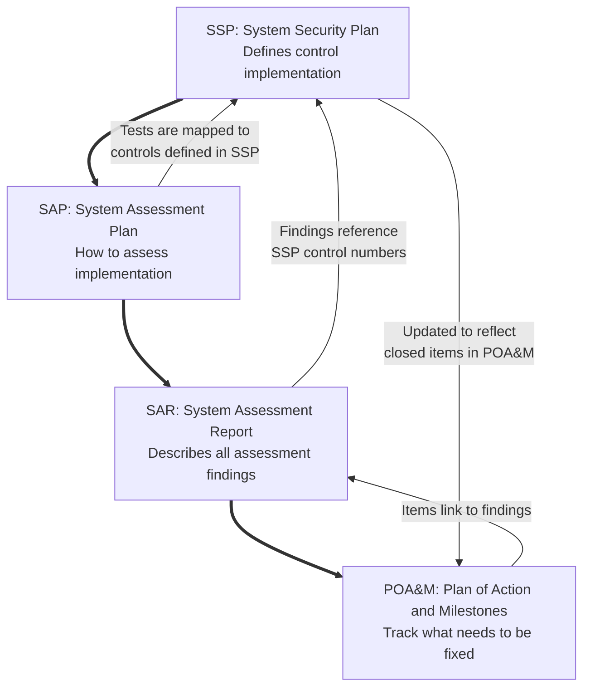

---
{"dg-publish":true,"permalink":"/frameworks-standards-and-regulations/nist/nist-sp-800-37/"}
---

#### NIST SP 800-37 (RMF)
- "The Risk Management Framework (RMF) provides a process that integrates security, privacy, and cyber supply chain risk management activities into the system development life cycle."^[[NIST Risk Management Framework | CSRC](https://csrc.nist.gov/projects/risk-management/about-rmf)]
- RMF map created by Aron Lange:^[ [Here are some of the top free resources that will help you to break into GRC and information security. - Aron Lange](https://www.linkedin.com/feed/update/urn:li:activity:6977867944248627200)] ^[This is for my own reference, and won't be accessible on the site: [[NIST RMF.pdf]]]

<iframe src="https://drive.google.com/file/d/10CcrJEA3GEe8Hjk35PlGQc0c8bTWVnCM/preview" width="640" height="480" allow="autoplay"></iframe>

  <a href="https://drive.google.com/file/d/10CcrJEA3GEe8Hjk35PlGQc0c8bTWVnCM/view?usp=sharingdl=1" target="_blank">
    Download the NIST RMF PDF by Aron Lange
  </a>

## Critical Documents in the RMF Process
SSP → SAP → SAR → POA&M
- **Select Controls**
	- SSP defines what should be implemented
- **Assess Controls**
	- SAP defines how to test implementations
	- SAR documents what was found
	- POA&M tracks what needs to be fixed

## RMF
1. The [[Frameworks, Standards, and Regulations/NIST/NIST SP 800-37\|RMF]] is a *7-step* continuous cycle to understand and provide a uniform approach to securing information systems
	1. These are the steps:
		1. Prepare
		2. Categorize
		3. Select
		4. Implement
		5. Assess (Audit)
		6. Authorize
		7. Monitor
2. RMF Step Guide
	1. **Prepare**:^[Not discussed in Gerald's video, but detailed here for reference.] Setup the organization for success
		1. Identify systems and stakeholders in the business and assign role for executing the RMF
		2. Conduct risk assessments and get a baseline of current risk and security practices
		3. **Max note**: Without any practical experience myself, I feel like Gerald combined the *Prepare* and *Categorize* tasks, and I think that omission would likely make subsequent steps more difficult.
	2. **Categorize**: Identifying potential impact
		1. [[FIPS 199\|FIPS 199]] and [[Frameworks, Standards, and Regulations/NIST/NIST 800-53/FIPS 200\|FIPS 200]] are used to identify potential impact of a system
			1. Describes the importance of a system and steps required to secure it
		2. Impact ratings are chosen between High, Moderate, and Low
			1. 80-90% of systems are *Moderate* impact systems
			2. *High* ratings are reserved for national security or classified systems
			3. *Low* ratings are also rare, non-business critical
		3. [[Frameworks, Standards, and Regulations/NIST/NIST SP 800-60\|NIST SP 800-60]] provides guidelines on the impact you should assign to certain systems
			1. More on this here: [NIST RMF System Categorization Step Hands On (Using SP 800-60 Vol II) - YouTube](https://www.youtube.com/watch?v=yAfM2E2aJEM)
		4. The [[Frameworks, Standards, and Regulations/NIST/NIST CSF/NIST CSF\|NIST CSF]] provides a mapping 
	3. **Select**: Select controls to implement from [[Frameworks, Standards, and Regulations/NIST/NIST 800-53/800-53R5\|NIST 800-53]]
		1. Basically a big dictionary with hundreds of controls
		2. The outcome of this step is the *SSP* ([[Frameworks, Standards, and Regulations/NIST/System Security Plan\|System Security Plan]]), and instructions on how to create one are found in the [NIST SP 800-18](https://csrc.nist.gov/pubs/sp/800/18/r1/final)
			1. This is the book/plan for the documentation of your system
				1. Network diagram, who owns the system, what kind of data is stored, etc.
				2. All the controls to secure the systems and how they are implemented
					1. May be more or less complicated, depending on the size of the organization
			2. Gerald specifically mentions the [[NIST SP 800-15\|NIST SP 800-15]], but it was withdrawn in September of the year he published his video
	4. **Implement**: Implement the controls, the lions-share of the work
		1. If you have any challenges implementing controls, NIST has implementation guides for most systems
			1. Offer tons of instructions and things you can do
	5. **Assess**: Bring in an independent auditor to inspect your controls
		1. For [[Frameworks, Standards, and Regulations/NIST/FISMA\|FISMA]] or anything else, you will need an external auditor
			1. If this is purely internal, can do it yourself, but it's better to have someone else verify
	6. **Authorize**: Authorize the system
		1. Basically just a memo from the person responsible authorizing the system to operate
			1. Usually just a page or so with their signature
		2. What's missing in this (as of 2021) is a risk assessment
			1. Use [[NIST 800-30\|NIST 800-30]] to asses risk
				1. Residual risk for controls not implemented, etc.
		3. This grants an Authorization to Operate for 1-3 years, depending on the requirements
	7. **Monitor**: Monitor the controls
		1. Systems are monitored and brought re-audited at regular intervals
		2. Often the audits are often scheduled to be tested in a kind of sequence to prevent infrequent massive effort

# Resources

#### Official
- [NIST Risk Management Framework \| CSRC](https://csrc.nist.gov/projects/risk-management/about-rmf)
	- [SP 800-37 Rev. 2, Risk Management Framework for Information Systems and Organizations: A System Life Cycle Approach for Security and Privacy | CSRC](https://csrc.nist.gov/pubs/sp/800/37/r2/final)
	- Direct link to the PDF: [nvlpubs.nist.gov/nistpubs/SpecialPublications/NIST.SP.800-37r2.pdf](https://nvlpubs.nist.gov/nistpubs/SpecialPublications/NIST.SP.800-37r2.pdf)
	- 183 pages
- [dhs.gov/sites/default/files/2023-08/23\_0803\_cpo\_ security-authorization-process-guide.pdf](https://www.dhs.gov/sites/default/files/2023-08/23_0803_cpo_%20security-authorization-process-guide.pdf)
	- This is the DHS "System Security Authorization Process Guide"
	- 32 pages (66 with appendices) that maps the RMF to their ATO (authorization to operate) process.
#### Supplemental
##### Articles
- ~~[NIST Risk Management Framework - by Aron Lange](https://blog.grclab.com/p/nist-risk-management-framework)~~
	- 	Super short and has a great graphic which details every step and task of the RMF
	- Original link down; updated link to LinkedIn post here, which has additional resources and the graphic but lacks the article: [💥Here are some of the top free resources that will help you to break into GRC and information security. - Aron Lange](https://www.linkedin.com/feed/update/urn:li:activity:6977867944248627200)
##### Videos
- Dr. Gerald Auger^[oh-zher]
	- [Definitive Guide to RMF (Actionable plan for FISMA Compliance) - YouTube](https://www.youtube.com/watch?v=8zxzqpw0jBA)
		- 15 minute long video
		- Older, includes references to documents that have been withdrawn and doesn't include the "Prepare" phase
	- [NIST RMF FULLY EXPLAINED (IN PLAIN ENGLISH) - YouTube](https://www.youtube.com/watch?v=Z2okRecJC7E)
		- 1h12m video *long*
		- I love and hate Gerry Auger videos; his content is great and helpful, but his style meanders and can be very distracting
