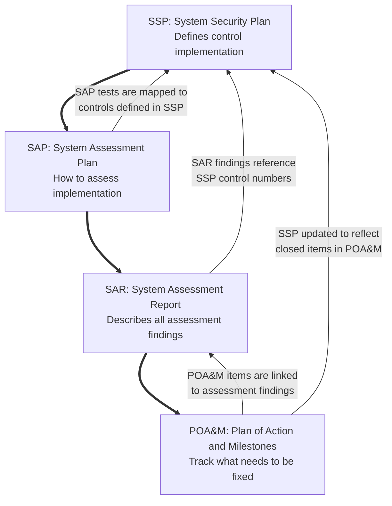

---
{"dg-publish":true,"permalink":"/frameworks-standards-and-regulations/nist/rmf/nist-sp-800-37-rmf/"}
---

#### NIST SP 800-37 (RMF)
1. "The Risk Management Framework (RMF) provides a process that integrates security, privacy, and cyber supply chain risk management activities into the system development life cycle."^[[NIST Risk Management Framework | CSRC](https://csrc.nist.gov/projects/risk-management/about-rmf)]
	1. The RMF is intended for use in the US government's authorization to operate process, as compared to the [[Frameworks, Standards, and Regulations/NIST/NIST CSF/NIST CSF\|CSF]], which is intended for use across industries with fewer administration requirements.
2. The RMF is a rigorous, prescriptive framework, which uses risk as the primary motivator in selecting security controls to implement.
	1. It uses a high-watermark standard of system impact to determine which baseline of controls to select and implement
3. The [[Frameworks, Standards, and Regulations/NIST/RMF/NIST SP 800-37 (RMF)\|RMF]] is a *7-step* continuous cycle to understand and provide a uniform approach to securing information systems. Below is each step and its associated documentation, per NIST.
	1. **Prepare**
		1. [SP 800-18 Rev. 1, Guide for Developing Security Plans for Federal Information Systems \| CSRC](https://csrc.nist.gov/pubs/sp/800/18/r1/final)
		2. [SP 800-30 Rev. 1, Guide for Conducting Risk Assessments \| CSRC](https://csrc.nist.gov/pubs/sp/800/30/r1/final)
		3. [SP 800-39, Managing Information Security Risk: Organization, Mission, and Information System View \| CSRC](https://csrc.nist.gov/pubs/sp/800/39/final)
		4. [SP 800-160 Vol. 1 Rev. 1, Engineering Trustworthy Secure Systems \| CSRC](https://csrc.nist.gov/pubs/sp/800/160/v1/r1/final)
		5. [IR 8062, An Introduction to Privacy Engineering and Risk Management in Federal Systems \| CSRC](https://csrc.nist.gov/pubs/ir/8062/final)
	2. **Categorize System**
		1. [FIPS 199, Standards for Security Categorization of Federal Information and Information Systems \| CSRC](https://csrc.nist.gov/pubs/fips/199/final)
		2. [SP 800-60 Rev. 2, Guide for Mapping Types of Information and Systems to Security Categories \| CSRC](https://csrc.nist.gov/pubs/sp/800/60/r2/iwd)
		3. [CUI Registry \| National Archives](https://www.archives.gov/cui/registry/category-list)
	3. **Select Controls**
		1. [FIPS 200, Minimum Security Requirements for Federal Information and Information Systems \| CSRC](https://csrc.nist.gov/pubs/fips/200/final)
		2. [SP 800-53 Rev. 5, Security and Privacy Controls for Information Systems and Organizations \| CSRC](https://csrc.nist.gov/pubs/sp/800/53/r5/upd1/final)
			1. [[Frameworks, Standards, and Regulations/NIST/NIST 800-53/800-53R5\|NIST SP 800-53 (my notes)]]
	4. **Implement Controls**
		1. Various publications described in SP 800-53 providing guidance on implementation of controls
	5. **Assess Controls**
		1. [SP 800-53A Rev. 5, Assessing Security and Privacy Controls in Information Systems and Organizations \| CSRC](https://csrc.nist.gov/pubs/sp/800/53/a/r5/final)
			1. [[Frameworks, Standards, and Regulations/NIST/NIST 800-53/800-53A\|NIST SP 800-53A (my notes)]]
	6. **Authorize System**
		1. [SP 800-37 Rev. 2, Risk Management Framework for Information Systems and Organizations: A System Life Cycle Approach for Security and Privacy \| CSRC](https://csrc.nist.gov/pubs/sp/800/37/r2/final)
	7. **Monitor Controls**
		1. [SP 800-37 Rev. 2, Risk Management Framework for Information Systems and Organizations: A System Life Cycle Approach for Security and Privacy \| CSRC](https://csrc.nist.gov/pubs/sp/800/37/r2/final)
		2. 		1. [SP 800-53A Rev. 5, Assessing Security and Privacy Controls in Information Systems and Organizations \| CSRC](https://csrc.nist.gov/pubs/sp/800/53/a/r5/final)
			1. [[Frameworks, Standards, and Regulations/NIST/NIST 800-53/800-53A\|NIST SP 800-53A (my notes)]]
		3. [SP 800-137, Information Security Continuous Monitoring (ISCM) for Federal Information Systems and Organizations \| CSRC](https://csrc.nist.gov/pubs/sp/800/137/final)

NIST's RMF wheel highlighting key documentation.^[[Risk Management Framework (RMF) Overview - FISMA Implementation Project | CSRC](https://csrc.nist.rip/Projects/Risk-Management/Risk-Management-Framework-(RMF)-Overview)]

<iframe src="https://drive.google.com/file/d/10CcrJEA3GEe8Hjk35PlGQc0c8bTWVnCM/preview" width="1080" height="780" allow="autoplay"></iframe>
RMF map created by Aron Lange:^[[Here are some of the top free resources that will help you to break into GRC and information security. - Aron Lange](https://www.linkedin.com/feed/update/urn:li:activity:6977867944248627200)]

## Critical Documents in the RMF Process
These documents are required for FISMA compliance, under the step in which they are created.^[[dhs.gov/sites/default/files/2023-08/23\_0803\_cpo\_ security-authorization-process-guide.pdf](https://www.dhs.gov/sites/default/files/2023-08/23_0803_cpo_%20security-authorization-process-guide.pdf)] 

- **3. Select Controls** and **4. Implement Controls**
	- SSP: Security Plan
		- Defines what should be implemented
		- This is a living document; it should accurately describe the controls protecting the system
- **5. Assess Controls**
	- SAP: Assessment Plan
		- Defines how to test implementations
	- SAR: Assessment Report
		- Documents what was found
	- POA&M: Plan of Action and Milestone
		- Tracks what needs to be fixed

Each document feeds into the next, and missing documents can can lead to process failures or not being being granted authorization to operate.

## RMF Step Guide

1. **Prepare**:^[Not discussed in Gerald's video, but detailed here for reference.] Setup the organization for success
	1. Identify systems and stakeholders in the business and assign role for executing the RMF
	2. Conduct a risk assessment^[[SP 800-30 Rev. 1, Guide for Conducting Risk Assessments \| CSRC](https://csrc.nist.gov/pubs/sp/800/30/r1/final)] and get a baseline of current risk and security practices
2. **Categorize**: Identifying potential impact
	1. [[Frameworks, Standards, and Regulations/NIST/FIPS 199\|FIPS 199]] and [[Frameworks, Standards, and Regulations/NIST/FIPS 200\|FIPS 200]] are used to identify the potential security and privacy impact of a system breach to organizations and individuals
		1. Ratings of *Low*, *Moderate*, and *High* are applied to the three pillars of the [[Definitions and Topics/CIA Triad\|CIA Triad]]; confidentiality, integrity, availability
			1. A *Low* rating means that a loss of one of the pillars would have a limited adverse effect on victim organizations or individuals
			2. A *Moderate* rating means a serious effect
			3. A *High* rating is severe or catastrophic effect
		2. This is a *high watermark* standard, meaning that the highest rating for the system in the triad applies to the entire system
			1. [[Frameworks, Standards, and Regulations/NIST/FIPS 199\|FIPS 199]] provides more examples, but a system with *low* confidentiality, *moderate* integrity, and *high* availability ratings would be required to use the *high impact* baseline
		3. Over-speccing can lead to wasted resources, underspeccing can leave critical systems vulnerable
	2. [[Frameworks, Standards, and Regulations/NIST/NIST SP 800-60\|NIST SP 800-60]] provides guidelines on the impact you should assign to certain systems
		1. More on this here: [NIST RMF System Categorization Step Hands On (Using SP 800-60 Vol II) - YouTube](https://www.youtube.com/watch?v=yAfM2E2aJEM)
	3. The [[Frameworks, Standards, and Regulations/NIST/NIST CSF/NIST CSF\|NIST CSF]] 
3. **Select**: Select controls to implement from [[Frameworks, Standards, and Regulations/NIST/NIST 800-53/800-53R5\|NIST 800-53]]
	1. The 800-53 is basically a big dictionary with hundreds of controls
		1. Start with the baseline for your system's impact in [[Frameworks, Standards, and Regulations/NIST/NIST 800-53/800-53B\|800-53B]]
		2. Tailor the controls to your organization
	2. The outcome of this step is the *SSP* ([[Frameworks, Standards, and Regulations/NIST/RMF/System Security Plan\|System Security Plan]]), and instructions on how to create one are found in the [NIST SP 800-18](https://csrc.nist.gov/pubs/sp/800/18/r1/final)
		1. This is the book/plan for the documentation of your system
			1. Network diagram, who owns the system, what kind of data is stored, etc.
			2. All the controls to secure the systems and how they are implemented
				1. May be more or less complicated, depending on the size of the organization
		2. Gerald specifically mentions the [[NIST SP 800-15\|NIST SP 800-15]], but it was withdrawn in September of the year he published his video
4. **Implement**: Implement the controls, the lions-share of the work
	1. If you have any challenges implementing controls, NIST has implementation guides for most systems
		1. Offer tons of instructions and things you can do
5. **Assess**: Bring in an independent auditor to inspect your controls
	1. The *SSP* is used to create the *SAP* ([[System Assessment Plan\|System Assessment Plan]]) with the help of the [[Frameworks, Standards, and Regulations/NIST/NIST 800-53/800-53A\|800-53A]]
		1. The plan should include information like:
			1. 				Duration of site visits
			2. Who need to be interviewed
			3. What evidence is required
			4. Which controls will be tested
			5. When the report will be delivered
		2. The auditor should have a solid understanding of the controls you are investigating and be able to provide color and ask questions beyond the stated control in the [[Frameworks, Standards, and Regulations/NIST/NIST 800-53/800-53R5\|800-53R5]]
			1. The 800-53 can be quite technical, so making it understandable to regular humans is key.
	2.  The *SAR* ([[System Assessment Report\|System Assessment Report]]) and *POA&M* ([[Frameworks, Standards, and Regulations/NIST/NIST CSF/Plan of Action and Milestones\|Plan of Action and Milestones]]) are created as part of this step
		1. The *SAR* includes all information for the controls assessed, including the auditor's findings
		2. The *POA&M* maps those findings to actionable items and is prepared by the system owner.
	3. For [[Frameworks, Standards, and Regulations/NIST/FISMA\|FISMA]] or any kind of certification, organizations will need an external, independent auditor to conduct the assessment
6. **Authorize**: Authorize the system
	1. Basically just a memo from the person responsible authorizing the system to operate
		1. Usually just a page or so with their signature
	2. What's missing in this (as of 2021) is a risk assessment
		1. Use [[Frameworks, Standards, and Regulations/NIST/RMF/NIST SP 800-30\|NIST SP 800-30]] to asses risk
			1. Residual risk for controls not implemented, etc.
	3. This grants an Authorization to Operate for 1-3 years, depending on the requirements
7. **Monitor**: Monitor the controls
	1. Systems are monitored and brought re-audited at regular intervals
	2. The system owners continue conducting assessments, risk treatment, and work on the implementing the POA&M
	3. Often the audits are often scheduled to be tested in a kind of sequence to prevent infrequent massive effort

# Resources

#### Official
- [NIST Risk Management Framework \| CSRC](https://csrc.nist.gov/projects/risk-management/about-rmf)
	- [SP 800-37 Rev. 2, Risk Management Framework for Information Systems and Organizations: A System Life Cycle Approach for Security and Privacy | CSRC](https://csrc.nist.gov/pubs/sp/800/37/r2/final)
	- Direct link to the PDF: [nvlpubs.nist.gov/nistpubs/SpecialPublications/NIST.SP.800-37r2.pdf](https://nvlpubs.nist.gov/nistpubs/SpecialPublications/NIST.SP.800-37r2.pdf)
	- 183 pages
- [dhs.gov/sites/default/files/2023-08/23\_0803\_cpo\_ security-authorization-process-guide.pdf](https://www.dhs.gov/sites/default/files/2023-08/23_0803_cpo_%20security-authorization-process-guide.pdf)
	- This is the DHS "System Security Authorization Process Guide"
	- 32 pages (66 with appendices) that maps the RMF to their ATO (authorization to operate) process.
#### Supplemental
##### Articles
- ~~[NIST Risk Management Framework - by Aron Lange](https://blog.grclab.com/p/nist-risk-management-framework)~~
	- 	Super short and has a great graphic which details every step and task of the RMF
	- Original link down; updated link to LinkedIn post here, which has additional resources and the graphic but lacks the article: [💥Here are some of the top free resources that will help you to break into GRC and information security. - Aron Lange](https://www.linkedin.com/feed/update/urn:li:activity:6977867944248627200)
##### Videos
- Dr. Gerald Auger^[oh-zher]
	- [Definitive Guide to RMF (Actionable plan for FISMA Compliance) - YouTube](https://www.youtube.com/watch?v=8zxzqpw0jBA)
		- 15 minute long video
		- Older, includes references to documents that have been withdrawn and doesn't include the "Prepare" phase
	- [NIST RMF FULLY EXPLAINED (IN PLAIN ENGLISH) - YouTube](https://www.youtube.com/watch?v=Z2okRecJC7E)
		- 1h12m video *long*
		- I love and hate Gerry Auger videos; his content is great and helpful, but his style meanders and can be very distracting
