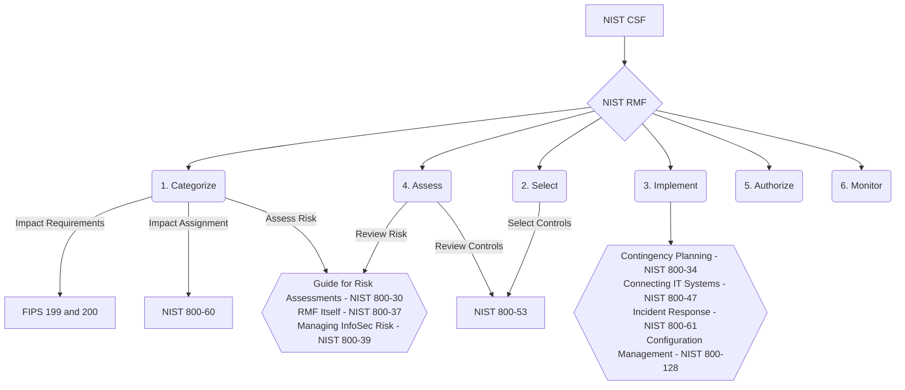

---
{"dg-publish":true,"permalink":"/security-frameworks/nist/nist-frameworks-and-s-ps-overview/"}
---

### What's the recommended order for study leading to the 800-53?
NIST actually has a series of free online courses to introduce anyone to the RMF, 800-53, and the 800-53A and 53B, accessible here: [NIST Risk Management Framework | CSRC](https://csrc.nist.gov/projects/risk-management/rmf-courses)

The course uses cookies to track progress through the slides, which is not ideal, but I guess better than creating an account.

#### Rough Flowchart
> Note that I moved the fourth step, **Assess**, to sit between steps 1 and 2, because I felt it made the chart easier to read.

#### Additional Resources

### Gerald Auger Definitive Guide to RMF
[Definitive Guide to RMF (Actionable plan for FISMA Compliance) - YouTube](https://www.youtube.com/watch?v=8zxzqpw0jBA)
1. Video Overview
	1. Duration - 15:40
		1. First two minutes are purely introduction - skip to [2:39](https://youtu.be/8zxzqpw0jBA?si=ZvR4u-Rwlj0lZPiS&t=159)
	2. Focus is on [[Security Frameworks/NIST/NIST SP 800-37\|NIST SP 800-37]]
2. The [[Security Frameworks/NIST/NIST SP 800-37\|RMF]] is a 6-step continuous cycle to understand and provide a uniform approach to securing information systems
	1. These are the steps:
		1. Categorize
		2. Select
		3. Implement
		4. Assess (Audit)
		5. Authorize
		6. Monitor
3. **Categorize**: Identifying potential impact
	1. [[FIPS 199\|FIPS 199]] and [[FIPS 200\|FIPS 200]] are used to identify potential impact of a system
		1. Describes the importance of a system and steps required to secure it
	2. Impact ratings are chosen between High, Moderate, and Low
		1. 80-90% of systems are *Moderate* impact systems
		2. *High* ratings are reserved for national security or classified systems
		3. *Low* ratings are also rare, non-business critical
	3. [[NIST SP 800-60\|NIST SP 800-60]] provides guidelines on the impact you should assign to certain systems
		1. More on this here: [NIST RMF System Categorization Step Hands On (Using SP 800-60 Vol II) - YouTube](https://www.youtube.com/watch?v=yAfM2E2aJEM)
4. **Select**: Select controls to implement from [[Security Frameworks/NIST/NIST 800-53/800-53R5\|800-53R5]]
	1. Basically a big dictionary with hundreds of controls
	2. We're just baselining, so able to pick and choose as needed
5. **Implement**: Implement the controls, the lions-share of the work
	1. Make a "System Security Plan"
		1. This is the book/plan for the documentation of your system
			1. Network diagram, who owns the system, what kind of data is stored, etc.
			2. All the controls to secure the systems and how they are implemented
				1. May be more or less complicated, depending on the size of the organization
		2. Gerald specifically mentions the [[NIST SP 800-15\|NIST SP 800-15]], but it was withdrawn in September of the year he published his video
	2. If you have any challenges implementing controls, NIST has implementation guides for most systems
		1. Offer tons of instructions and things you can do
6. **Assess**: Bring in an independent auditor to inspect your controls
	1. For [[FISMA\|FISMA]] or anything else, you will need an external auditor
		1. If this is purely internal, can do it yourself, but it's better to have someone else verify
7. **Authorize**: Authorize the system
	1. Basically just a memo from the person responsible authorizing the system to operate
		1. Usually just a page or so with their signature
	2. What's missing in this (as of 2021) is a risk assessment
		1. Use [[NIST 800-30\|NIST 800-30]] to asses risk
			1. Residual risk for controls not implemented, etc.
	3. This grants an Authorization to Operate for 1-3 years, depending on the requirements
8. **Monitor**: Monitor the controls
	1. Systems are monitored and brought re-audited at regular intervals
	2. Often the audits are often scheduled to be tested in a kind of sequence to prevent infrequent massive effort

##### RiskOptics
This guide ([Complete Guide to the NIST Cybersecurity Framework — RiskOptics](https://reciprocity.com/resource-center/complete-guide-to-the-nist-cybersecurity-framework/)) provides a thorough introduction to the NIST Cybersecurity Framework and how it interrelates.

##### ChatGPT
The list below was generated by ChatGPT, and it feels like it front loads a lot, according to the Gerald Auger video. 
1. [[Security Frameworks/NIST/NIST CSF/NIST CSF\|NIST CSF]]
	1. **Purpose**: The CSF provides a high-level overview of cybersecurity concepts and outlines six core functions: Govern, Identify, Protect, Detect, Respond, and Recover. Understanding the CSF helps grasp the broader objectives of cybersecurity practices that SP 800-53 aims to support with specific controls.
	2. **Relevance**: It sets the stage for understanding the risk-based approach to selecting and implementing the appropriate controls detailed in SP 800-53.
2. [[Security Frameworks/NIST/NIST SP 800-37\|NIST SP 800-37 - RMF]]
	1. **Purpose**: SP 800-37 guides the implementation of the RMF and explains how to integrate security and risk management activities into the system development life cycle.
	2. **Relevance**: SP 800-53 is used within the RMF as the catalog of controls for organizations to implement based on their specific risk assessments. Understanding the RMF is crucial for knowing how and why specific controls from SP 800-53 are selected.
3. [[NIST SP 800-39\|NIST SP 800-39 - Managing Information Security Risk]]
	4. **Purpose**: This document provides a structured approach to managing risk at the organizational, mission/business process, and information system levels.
	5. **Relevance**: It helps understand the broader context of organizational risk management, within which SP 800-53 controls are applied.
4. [[NIST 800-30\|NIST 800-30 - Guide for Conducting Risk Assessments]]
	1. **Purpose**: SP 800-30 provides detailed instructions on conducting risk assessments, which are crucial for identifying threats, vulnerabilities, and impacts.
	2. **Relevance**: Knowing how to assess risk is essential for appropriately applying and tailoring the controls in SP 800-53 to an organization’s specific needs.
5. [[NIST 800-53A\|NIST 800-53A - Assessing Security and Privacy Controls]]
	1. **Purpose**: This publication serves as a companion document to SP 800-53, focusing on assessing the effectiveness of the implemented controls.
	2. **Relevance**: Understanding the assessment process helps ensure that the controls detailed in SP 800-53 are not only implemented but are also effective and functioning as intended.
6. [[Security Frameworks/NIST/NIST 800-53/800-53R5\|NIST SP 800-53]]

## Difference between NIST frameworks:
[What is the main difference between these 3 framworks? : r/cybersecurity](https://www.reddit.com/r/cybersecurity/comments/11h09bz/what_is_the_main_difference_between_these_3/)
- NIST 800-53 - This one was made specifically for the US federal govt. To quote _"The use of these controls is mandatory for federal information systems10 in accordance with Office of Management and Budget (OMB) Circular A-130 "_ As the name implies it's very specific around controls.
- NIST CSF - Again to quote the NIST site: " The Framework is based on existing standards, guidelines, and practices for organizations to better manage and reduce cybersecurity risk. In addition, it was designed to foster risk and cybersecurity management communications amongst both internal and external organizational stakeholders." Think of this one as being a bit "higher level" than 800-53 as it's more focused on an overall program then just controls.
- NIST RMF - " The NIST Risk Management Framework (RMF) provides a comprehensive, flexible, repeatable, and measurable 7-step process that any organization can use to manage information security and privacy risk for organizations and systems and links to a suite of NIST standards and guidelines to support implementation of risk management programs to meet the requirements of the Federal Information Security Modernization Act (FISMA)." As stated this one is more focused on risk and was again created for federal entities to use to satsfy the requiremetns of FISMA. It would be part of what you do in the NIST CSF. 800-53 and the CSF work hand in hand with this.

